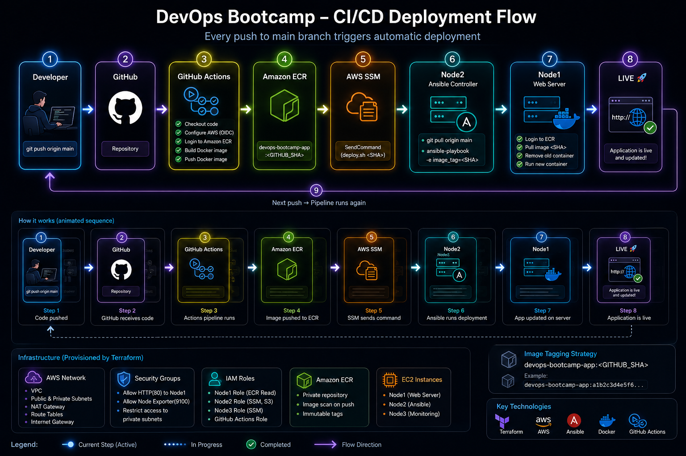

# 🚀 DevOps Bootcamp Project

<p align="center">
  
</p>

A complete AWS DevOps project demonstrating **Infrastructure as Code, configuration management, containerization, private container registry, AWS Systems Manager, and GitHub Actions CI/CD**.

---

## 🏗️ Architecture

```text
                                  ┌──────────────────────┐
                                  │       GitHub         │
                                  │   Source Repository  │
                                  └──────────┬───────────┘
                                             │
                                      git push main
                                             │
                                             ▼
                              ┌──────────────────────────┐
                              │      GitHub Actions       │
                              │                          │
                              │  Checkout                │
                              │  GitHub OIDC → AWS       │
                              │  Docker Build            │
                              │  Push → Amazon ECR       │
                              └────────────┬─────────────┘
                                           │
                                           ▼
                              ┌──────────────────────────┐
                              │       Amazon ECR          │
                              │                          │
                              │ devops-bootcamp-app      │
                              │ :<Git Commit SHA>        │
                              └────────────┬─────────────┘
                                           │
                                  SSM SendCommand
                                           │
                                           ▼
                  ┌────────────────────────────────────────────────┐
                  │                     Node2                      │
                  │               Ansible Controller               │
                  │                                                │
                  │  sudo -u ubuntu                                │
                  │       │                                        │
                  │       ▼                                        │
                  │   deploy.sh <SHA>                              │
                  │       │                                        │
                  │       ├── git pull origin main                 │
                  │       │                                        │
                  │       └── ansible-playbook                     │
                  └──────────────────────┬─────────────────────────┘
                                         │
                                  AWS SSM / aws_ssm
                                         │
                                         ▼
                  ┌────────────────────────────────────────────────┐
                  │                     Node1                      │
                  │                  Web Server                    │
                  │                                                │
                  │  Ansible                                       │
                  │    ├── Login to ECR                            │
                  │    ├── Pull image :<Git SHA>                   │
                  │    ├── Remove old container                    │
                  │    └── Start new container                     │
                  │                                                │
                  │             Docker :80                         │
                  └──────────────────────┬─────────────────────────┘
                                         │
                                         ▼
                                      Internet


                  ┌────────────────────────────────────────────────┐
                  │                     Node3                      │
                  │                  Monitoring                    │
                  │                                                │
                  │              Cloudflare Tunnel                 │
                  └────────────────────────────────────────────────┘
```

---

## 🔄 End-to-End Flow

The complete deployment flow is:

```text
Developer
   │
   │ git push origin main
   ▼
GitHub
   │
   ▼
GitHub Actions
   │
   ├── Checkout source
   │
   ├── Authenticate to AWS using OIDC
   │
   ├── Login to Amazon ECR
   │
   ├── Docker build
   │
   └── Docker push
           │
           ▼
        Amazon ECR
           │
           │ image:<GITHUB_SHA>
           ▼
     SSM SendCommand
           │
           ▼
         Node2
           │
           ├── git pull
           │
           └── deploy.sh
                   │
                   ▼
               Ansible
                   │
                   │ AWS SSM
                   ▼
                 Node1
                   │
                   ├── ECR login
                   ├── docker pull
                   ├── stop/remove old container
                   └── start new container
                           │
                           ▼
                      New version live
```

---

# ☁️ AWS Infrastructure

Infrastructure is provisioned using **Terraform**.

### Main components

- VPC
- Public subnet
- Private subnet
- Internet Gateway
- NAT Gateway
- Route tables
- Security Groups
- Elastic IP
- 3 EC2 instances
- IAM roles and instance profiles
- Amazon ECR
- GitHub Actions OIDC provider
- S3 Terraform backend

### EC2 layout

| Node | Purpose | Network |
|---|---|---|
| Node1 | Web Server / Docker | Public subnet |
| Node2 | Ansible Controller | Private subnet |
| Node3 | Monitoring / Cloudflare Tunnel | Private subnet |

---

# 🔐 IAM Design

IAM roles are separated according to responsibility.

```text
Node1
└── devops-webserver-role
    ├── AmazonSSMManagedInstanceCore
    └── AmazonEC2ContainerRegistryReadOnly

Node2
└── devops-ansible-role
    ├── AmazonSSMManagedInstanceCore
    ├── SSM permissions
    └── S3 permissions

Node3
└── devops-monitoring-role
    └── AmazonSSMManagedInstanceCore

GitHub Actions
└── devops-github-actions-role
    ├── ECR Push
    └── SSM deployment
```

GitHub Actions does **not** use long-lived AWS access keys.

Authentication uses:

```text
GitHub Actions
      │
      ▼
GitHub OIDC
      │
      ▼
AWS STS
      │
      ▼
devops-github-actions-role
```

---

# 🐳 Docker

The application is containerized using Docker.

The image is built from:

```text
app/
└── Dockerfile
```

Images are stored in Amazon ECR.

Instead of using only:

```text
:latest
```

the project uses the Git commit SHA:

```text
devops-bootcamp-app:<GITHUB_SHA>
```

Example:

```text
devops-bootcamp-app:bb85b1214f5581aef7316c41336b66df3dd92ec0
```

This gives every deployment a unique image version.

---

# 📦 Amazon ECR

Terraform creates:

```text
devops-bootcamp-app
```

ECR is configured with:

- Immutable image tags
- Scan on push
- `force_delete = true` for the current development setup

Example:

```text
990723917403.dkr.ecr.ap-southeast-1.amazonaws.com/devops-bootcamp-app:<GITHUB_SHA>
```

---

# ⚙️ Ansible

Node2 acts as the Ansible Controller.

Ansible communicates with Node1 through AWS Systems Manager instead of SSH.

```text
Node2
  │
  │ Ansible
  ▼
amazon.aws.aws_ssm
  │
  ▼
AWS Systems Manager
  │
  ▼
Node1
```

## Ansible Galaxy

The playbook automatically installs:

```text
geerlingguy.docker
community.docker
```

The Docker Galaxy role is used to install and configure Docker.

---

# 📋 Ansible Deployment

The main playbook is:

```text
ansible/playbooks/playbooks-nginx-deploy.yaml
```

The deployment performs:

```text
Install Docker
       ↓
Install required packages
       ↓
Check / install AWS CLI
       ↓
Create ssm-user
       ↓
Add ssm-user to docker group
       ↓
Install Python Docker SDK
       ↓
Login to ECR
       ↓
Pull application image
       ↓
Remove old container
       ↓
Start new container
```

The image tag is supplied dynamically:

```bash
-e "image_tag=${GITHUB_SHA}"
```

---

# 🚀 Deployment Script

`deploy.sh` acts as the bridge between GitHub Actions and Ansible.

```text
GitHub Actions
      │
      ▼
SSM command → Node2
      │
      ▼
deploy.sh <SHA>
      │
      ├── git pull origin main
      │
      └── ansible-playbook
```

Example:

```bash
./deploy.sh bb85b1214f5581aef7316c41336b66df3dd92ec0
```

---

# 🔁 CI/CD Pipeline

Workflow file:

```text
.github/workflows/cicd.yaml
```

## Continuous Integration

```text
Git push
   ↓
Checkout
   ↓
AWS OIDC authentication
   ↓
ECR login
   ↓
Docker build
   ↓
Docker push
```

## Continuous Deployment

```text
ECR image
   ↓
SSM SendCommand
   ↓
Node2
   ↓
sudo -u ubuntu deploy.sh <SHA>
   ↓
git pull
   ↓
Ansible
   ↓
AWS SSM
   ↓
Node1
   ↓
Pull image <SHA>
   ↓
Restart container
```

GitHub Actions waits for the SSM command to complete before marking deployment as successful.

---

# 📁 Project Structure

```text
devops-bootcamp-project/
│
├── app/
│   ├── Dockerfile
│   └── ...
│
├── ansible/
│   ├── ansible.cfg
│   ├── inventory.ini
│   ├── deploy.sh
│   └── playbooks/
│       └── playbooks-nginx-deploy.yaml
│
├── terraform/
│   ├── providers.tf
│   ├── network.tf
│   ├── security.tf
│   ├── ec2.tf
│   ├── iam.tf
│   ├── ecr.tf
│   ├── inventory.tf
│   ├── inventory.ini.tftpl
│   └── outputs.tf
│
└── .github/
    └── workflows/
        └── cicd.yaml
```

---

# 🛠️ Setup From Scratch

## 1. Clone repository

```bash
git clone https://github.com/fareezizzudinothman/devops-bootcamp-project.git
cd devops-bootcamp-project
```

---

## 2. Configure AWS CLI

Configure your AWS credentials locally:

```bash
aws configure
```

Verify:

```bash
aws sts get-caller-identity
```

---

# 3. Deploy Infrastructure

```bash
cd terraform

terraform init
terraform fmt
terraform validate
terraform plan
terraform apply
```

After deployment:

```bash
terraform output
```

Important outputs include:

```text
ecr_repository_url
node1_private_ip_webserver
node2_private_ip_ansible
node3_private_ip_monitoring
web_server_elastic_ip_node1
```

---

# 4. Access Node2 Through SSM

Node2 is private and does not require a public IP.

Use the Terraform output:

```bash
aws ssm start-session --target <NODE2_INSTANCE_ID>
```

Then:

```bash
cd ~/devops-bootcamp-project
```

Verify Ansible:

```bash
ansible --version
```

Verify AWS CLI:

```bash
aws --version
```

Verify the AWS Ansible collection:

```bash
ansible-galaxy collection list
```

---

# 5. Test Ansible

From Node2:

```bash
cd ~/devops-bootcamp-project/ansible
```

Check Node1:

```bash
ansible node1 -m command -a "docker ps"
```

Run the deployment manually:

```bash
ansible-playbook playbooks/playbooks-nginx-deploy.yaml
```

---

# 6. Test ECR Deployment

Build the application locally:

```bash
cd app

docker build -t devops-bootcamp-app .
```

Login to ECR:

```bash
aws ecr get-login-password \
  --region ap-southeast-1 |
docker login \
  --username AWS \
  --password-stdin \
  <ECR_REPOSITORY_URL>
```

Tag:

```bash
docker tag \
  devops-bootcamp-app:latest \
  <ECR_REPOSITORY_URL>:v1
```

Push:

```bash
docker push <ECR_REPOSITORY_URL>:v1
```

---

# 7. Trigger CI/CD

After the GitHub Actions workflow has been configured:

```bash
git add .
git commit -m "update application"
git push origin main
```

GitHub Actions will automatically:

```text
Build
  ↓
Push to ECR
  ↓
SSM → Node2
  ↓
deploy.sh
  ↓
Ansible
  ↓
Node1
```

---

# 🔎 Verify Deployment

On Node2:

```bash
ansible node1 -m command -a "docker ps"
```

Expected result:

```text
IMAGE

990723917403.dkr.ecr.ap-southeast-1.amazonaws.com/
devops-bootcamp-app:<GITHUB_SHA>
```

The SHA should match the image built by the GitHub Actions run.

---

# 🎯 Why This Architecture?

### Terraform

Infrastructure is reproducible and managed as code.

### Ansible

Server configuration and application deployment are automated.

### Docker

The application runs consistently as a container.

### Amazon ECR

Provides a private registry for application images.

### AWS Systems Manager

Allows management and Ansible connectivity without exposing SSH.

### GitHub OIDC

Allows GitHub Actions to authenticate to AWS without storing long-lived AWS access keys.

### GitHub Actions

Automates the complete CI/CD process.

---

# 🧠 DevOps Concepts Demonstrated

This project demonstrates practical experience with:

- Linux
- Git
- GitHub
- Docker
- Docker image lifecycle
- CI/CD
- GitHub Actions
- AWS
- VPC
- Public and private subnets
- NAT Gateway
- Security Groups
- IAM
- IAM least-privilege concepts
- GitHub OIDC
- Amazon ECR
- Amazon EC2
- AWS Systems Manager
- Terraform
- Ansible
- Ansible Galaxy
- Cloudflare Tunnel
- Infrastructure as Code
- Configuration Management
- Immutable Docker image tagging
- Automated deployment

---

# 📌 Deployment Principle

The key principle of this project is:

```text
Code
 ↓
Git Commit SHA
 ↓
Docker Image
 ↓
Amazon ECR
 ↓
SSM
 ↓
Ansible
 ↓
Node1
 ↓
Docker Container
```

The same Git commit SHA is used throughout the deployment pipeline, allowing the deployed container to be traced back to the exact source commit.

---

## 🏁 Final Result

A developer only needs to do:

```bash
git push origin main
```

The rest is automated:

```text
Developer
    ↓
GitHub
    ↓
GitHub Actions
    ↓
Docker Build
    ↓
Amazon ECR
    ↓
AWS SSM
    ↓
Node2
    ↓
Ansible
    ↓
AWS SSM
    ↓
Node1
    ↓
Docker
    ↓
Application Live 🚀
```
